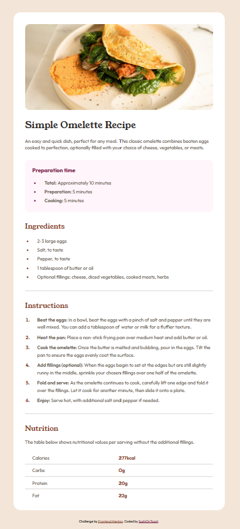

# Frontend Mentor - Recipe page solution

This is a solution to the [Recipe page challenge on Frontend Mentor](https://www.frontendmentor.io/challenges/recipe-page-KiTsR8QQKm). Frontend Mentor challenges help you improve your coding skills by building realistic projects. 

## Table of contents

- [Overview](#overview)
  - [The challenge](#the-challenge)
  - [Screenshot](#screenshot)
  - [Links](#links)
- [My process](#my-process)
  - [Built with](#built-with)
  - [What I learned](#what-i-learned)
  - [Useful resources](#useful-resources)
- [Author](#author)

## Overview

### The Challenge
My job was to create a recipe page using HTML and CSS, making it look as close to the preview image as possible - this meant that I had to judge the margins and widths by eye. I also had to make it responsive to different screen sizes.

### Screenshot



### Links

- [Solution URL (hosted on github pages)](#)

## My process

### Built with

- Semantic HTML5 markup
- CSS
- JavaScript

**Note: I am still very much a beginner so my knowledge is quite limited**

### What I learned

I learnt how to make tables using the `<div>` and `<hr` tag.

Here's a small snippet of my code to demonstrate how I achieved this:

HTML:
```html
<div class="nutrition-table">
      <div class="nutrition-element"><p>Calories</p></div><div class="nutrition-value"><p>277kcal</p></div>
      <!--I used 2 <p> tags next to each other as they had to be spaced apart-->

      <hr class="nutrition">

      <div class="nutrition-element"><p>Carbs</p></div><div class="nutrition-value"><p>0g</p></div>

      <hr class="nutrition">

      <div class="nutrition-element"><p>Protein</p></div><div class="nutrition-value"><p>20g</p></div>

      <hr class="nutrition">

      <div class="nutrition-element"><p>Fat</p></div><div class="nutrition-value"><p>22g</p></div>
</div>
```
CSS:
```css
.nutrition-value p {
    margin: 0px;
    font-weight: 700;
    color: hsl(14, 45%, 36%);
}

.nutrition-element p {
    margin: 0px;
    margin-left: 25px;
}

.nutrition-element, .nutrition-value {
    width: 50%; /* they still remain spaced apart when the window size is changed */
    display: inline-block; /* so that they sit next to each other */
}

.nutrition-table {
    padding-top: 15px;
}
```

### Useful resources

- [W3schools](https://www.w3schools.com/css/) - Helped me with styling certain elements
- [MDN web docs](https://developer.mozilla.org/en-US/) - Perfect for reference and looking at CSS attributes in detail

## Author

- Frontend Mentor - [@SushiOnToast](https://www.frontendmentor.io/profile/SushiOnToast)
- CodePen - [@SushiOnToast](https://codepen.io/SushiOnToast)
- CodeWars - [@SushiOnToast](https://www.codewars.com/users/SushiOnToast)

